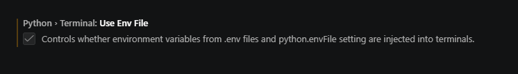

<h1> Welcome to the <b>B</b>ack<b>e</b>nd <b>S</b>et<b>u</b>p and Guide </h1>
This markdown file will be continuously updated with the intent to be a clear and transparent guide for the developers to see whats happening with the API and Database through the development process.


## Things to Add
* ~~How to install Flask and Flask CORS~~
* ~~How to connect via .env (Not included, intentional git ignore)~~
* ~~How to add necessary pieces of the .env to the github repo via settings > secrets and variables > Actions~~
* My surface level understanding on adding to the mongodb test suite


## Necessary changes [IDE]
If you run into this warning:


"An environment file is configured but terminal environment injection is disabled. Enable "python.terminal.useEnvFile" to use environment variables from .env files in terminals."

In your VSCODE settings.json make this change:
```json
{
    "python.terminal.useEnvFile": true
}
```
You can also activate it from the settings gui by searching for useEnv. 



## Dependencies
Fast install via the requirements.txt file 
```bash
pip install -r backend/requirements.txt
```


Manual install
```bash
pip install pymongo python-dotenv flask flask-cors
```


## Setting up the .env
```bash
# Atlas Connection 
MONGO_URI={Ask for the uniform resource identifier}

# Quality of life (Flask)
# FLASK_APP={appname.py}
# FLASK_ENV=development
# FLASK_DEBUG=1 
```
For github repo, you must also add the URI to the secrets and variables, which I will/have done already